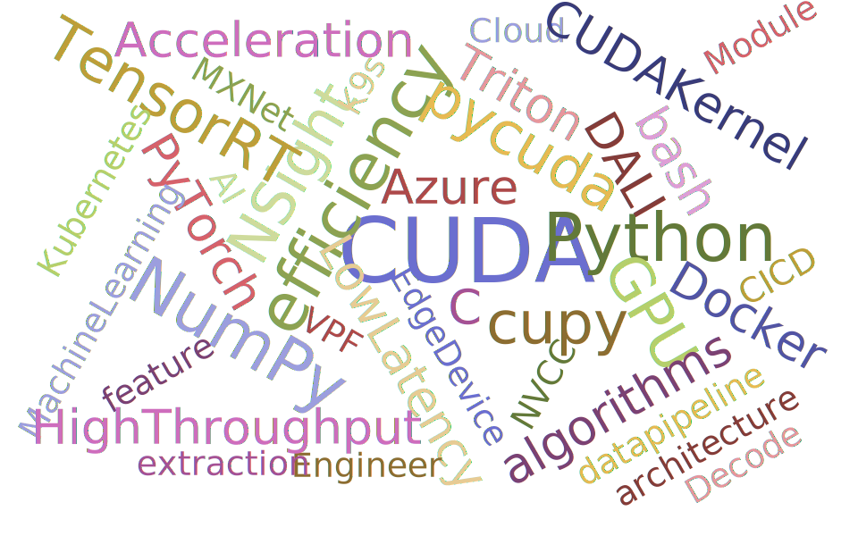

### Hi there 👋, this is Roy

## 🔭 Who am i ?
- ⚡ CUDA Developer
- 🧪 Machine Learning Engineer
- 🎓 Msc in Big Data Technology @ [HKUST](https://seng.hkust.edu.hk/academics/taught-postgraduate/msc-bdt)

## 🖥️ Projects
<!-- 
## 💼 Work Experience
| Company                                                                  | Role                      | Period      |
|:------------------------------------------------------------------------:| :-----------------------: |:-----------:|
|                             | Senior CUDA Engineer      | 2022 - 2023 |
|  | AI Systems Engineer       | 2020 - 2021 |
|                             | Machine Learning Engineer | 2019 - 2020 |
|                            | Engineering Associate     | 2018 - 2019 |
|                                                   | Research Assistant        | 2018 - 2019 | 
-->

<!-- 

 Projects 
 -->
<!-- 
|                                 | Project                                                                         |
| :------------------------------:| :------------------------------------------------------------------------------:|
|             | Pedestrian Detection and Tracking (2023)                                        |
|             | GPU Video Decoding (2023)                                                       |
|             | Image processing with CUDA Kernel (2022)                                        |
|             | CUDA clustering Kernel (2022)                                                   |
|             | Ensemble Age and Gender Model on TRITON with DALI (2022)                        |

|             | Pedestrian Detection on TensorRT (2019)                                         |
|             | Face Detection on TRTIS (now renamed as TRITON Inference Server) (2019)         |

|            | PPE detection on Edge Device (2021)                                             |
|            | Fatal Zone Alert on Edge Device (2021)                                          |
|            | Real Time PPE Detector on Edge Device (2021)                                    |

|             | DeGit (decentralized github with Smart Contract) (2022)                         |
|             | Federated Learning with FATE (2022)                                             |
|             | Real Time Pedestrian Detector on Edge Device (2020)                             |

|             | Fedearated Learning with Fog Computing on smart lamp-post (2019)                |
|             | Data fusion on smart contract (2019)                                            |

|              | EGG Signal Analysis (2018)                                                      |
 -->

<table>
    <thead>
        <tr>
            <th>Institution</th>
            <th>Role</th>
            <th>Period</th>
            <th>Project</th>
        </tr>
    </thead>
    <tbody>
            <tr> <!--  new session  -->
                <td rowspan=7 ALIGN=CENTER>
                

                </td>
                <td rowspan=5 >Senior CUDA Engineer</td>
                <td rowspan=2>2023</td>
                <td >Pedestrian Detection and Tracking</td>
            </tr>
            <tr><td>GPU Video Decoding</td></tr>
                <td rowspan=3>2022</td>
                <td>Image processing with CUDA Kernel</td>
            <tr><td>CUDA clustering Kernel</td></tr>
            <tr><td>Ensemble Age and Gender Model on TRITON with DALI</td></tr> 
            <tr>
                <td rowspan=2>Machine Learning Engineer</td>
                <td rowspan=2>2019</td>
                <td >Pedestrian Detection on TensorRT</td>
            </tr>
            <tr><td>Face Detection on TRTIS (former TRITON Inference Server)</td></tr>
            <tr> <!--  new session  -->
                <td rowspan=2 ALIGN=CENTER>
                

                </td>
                <td rowspan=2>AI Systems Engineer</td>
                <td rowspan=2>2021</td>
                <td >Real Time PPE Detector on Edge Device</td>
            </tr>
            <tr><td>Real Time Fatal Zone Alert on Edge Device</td></tr>
            <tr> <!--  new session  -->
                <td rowspan=3 ALIGN=CENTER>
                

                </td>
                <td rowspan=3>Master Degree Student</td>
                <td rowspan=2>2022</td>
                <td >DeGit (decentralized github with Smart Contract)</td>
            </tr>
            <tr><td>Federated Learning with FATE</td></tr>
                <td rowspan=1>2020</td>
                <td>Real Time Pedestrian Detector on Edge Device</td>
            <tr> <!--  new session  -->
                <td rowspan=2 ALIGN=CENTER>
                

                </td>
                <td rowspan=2>Engineering Associate</td>
                <td rowspan=2>2019</td>
                <td >Fedearated Learning with Fog Computing on smart lamp-post</td>
            </tr>
            <tr><td>Data fusion on smart contract</td></tr>
            <tr> <!--  new session  -->
                <td rowspan=1 ALIGN=CENTER>
                

                </td>
                <td rowspan=1>Research Assistant (pt)</td>
                <td rowspan=1>2018</td>
                <td >Real Time PPE Detector on Edge Device</td>
            </tr>
    </tbody>
</table>

---

    
    

## 📫 How to reach me:
-  [Linkedin](https://linkedin.com/in/fwyroy)
